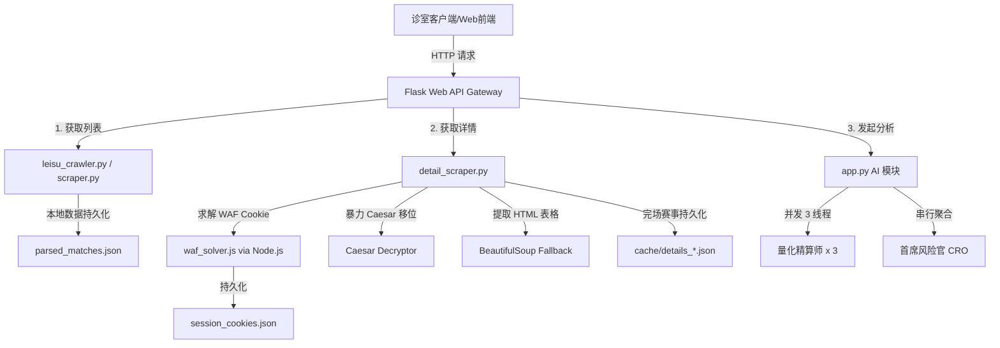

# 架构与设计说明书 (Architecture & Design)

## 目录
1. [系统总体架构](#1-系统总体架构)
2. [数据流与核心模块依赖](#2-数据流与核心模块依赖)
3. [核心组件与设计模式](#3-核心组件与设计模式)
4. [核心功能实现原理详细流程](#4-核心功能实现原理详细流程)

---

## 1. 系统总体架构

本系统为雷速体育赛事数据抓取、绕过、解密以及 AI 研判决策聚合系统。为了在无外网环境（局域网）或复杂反扒环境中稳定高效运行，系统设计遵循“离线优先、自愈重试、多级退化、风控收敛”的核心原则。

---

## 2. 数据流与核心模块依赖

1. **赛事列表爬取**：由 `scraper.py` (包含 PC 网页一键解密 `alifInfo.js`) 以及 `leisu_crawler.py` (API 抓取) 共同负责。抓取结果合并并进行全局 ID 去重，持久化写入 `parsed_matches.json`。
2. **比赛详情爬取与解析**：
   * 接口定义在 `app.py` `/api/match_details` 路由。
   * 业务逻辑由 `detail_scraper.py` 中的 `get_complete_match_details` 函数执行。
   * 支持从 `session_cookies.json` 加载已有 Cookie 凭证，或调用 Node 求解 WAF。
3. **AI 并发研判与收敛**：
   * 研判数据直接从详情接口获取。
   * 多线程执行 3 版精算师决策发散。
   * 串行运行 CRO 聚合层，执行熔断与降档收敛。
   * 研判输出写入本地 `cache/ai_analysis_*.json`。

---

## 3. 核心组件与设计模式

* **多级退化模式 (Multi-level Fallback Pattern)**：
  在详情解析中，JS 解密虽快但因赛事级别（冷门、次级联赛）不同可能导致字段数据缺失。系统设计了“比分质量审计”判定，一旦审计不合格立即无缝退化到 HTML BeautifulSoup 解析。
* **物理隔离分流模式 (Subdomain Separation)**：
  针对不同子域名对 WAF Cookie 的排他性（如 odds 子域不允许携带 live 的 Cookie），建立不同的全局 CookieJar，彻底杜绝 403 跨域污染。
* **大模型发散-收敛模式 (Generator-Validator Pattern)**：
  通过并发线程池生成 3 个不同 temperature 的发散分析，再通过 CRO 单独的角色和严格的熔断与收敛逻辑锁定最有数学期望值（Value）的选项。

---

## 4. 核心功能实现原理详细流程

### 4.1 雷速 WAF 挑战绕过与 Cookie 隔离分流
1. **触发拦截**：当请求 live 页面无 Cookie 时，雷速会下发 403/503 的拦截页面，包含 WAF 加密 JS 代码，要求完成 acw_sc__v2 挑战。
2. **Node.js 求解**：Python 自动拉起 Node.js 子进程，执行 `waf_solver.js`，传入页面 HTML、请求 URL 和 User-Agent，经过 acw_sc__v2 算法运算出绕过所需的安全 Cookie。
3. **Cookie 持久化与预装载**：解密出的 Cookie 会回写到 urllib 的 CookieJar 容器，并由 Playwright 持续同步到本地 `session_cookies.json` 中，供后续请求仿真装载。
4. **子域名物理隔离**：建立两套完全隔离的 `GLOBAL_CJ` / `GLOBAL_OPENER` 与 `GLOBAL_ODDS_CJ` / `GLOBAL_ODDS_OPENER`。请求 `odds.leisu.com` 子域名时只装载匹配该子域的 Cookie，绝对禁止混合携带以防被雷速安全防护拦截。

### 4.2 数据分析页 (shujufenxi) JS 加密数据暴力 Caesar 破解
1. **定位 JS 密文**：BeautifulSoup 匹配并抓取带有 `/shujufenxi/` 路径的外部 JS 文件。
2. **Caesar 移位穷举**：正则匹配出单/双引号包裹的 Base64 密文。使用 Caesar 26 个偏移量穷举移位，直至可以通过 Base64 解码并解压。
3. **数据反序列化**：对解压后的 utf-8 字节流执行 JSON 解析，获取完整的 H2H 交锋及战绩数据包。

### 4.3 比分质量审计与 HTML BeautifulSoup 退化 (Fallback) 机制
1. **数据健全性审计**：在 JS 数据解密成功并转换后，对比分列表做完整扫描。
2. **触发退化条件**：如果发现 H2H (历史交锋) 有交锋历史且所有比分均为 `"0:0"`，或者近期战绩的主客队战绩全为 `"0:0"`，判定为“雷速次级赛事 JS 数据源缺失比分”异常。
3. **BeautifulSoup 兜底解析**：重置数据，退化为直接解析静态 HTML 页面上的 Table 标签数据。通过对 `td` 节点的普通文本解析重新提取真实比分和胜负手。

### 4.4 三版本并发研判与 CRO 共识聚合
1. **并发发散**：利用 `ThreadPoolExecutor` 并发启动 3 个线程大模型请求（量化精算师），分别传入版本序号并在提示词中要求提供不同的发散切入点，配合 `temperature` 梯级。
2. **冲突软化与收敛**：首席风险官 (CRO) 审计下属 3 份报告：
   * 让球盘方向完全对立触发**【硬熔断】**，彻底放弃。
   * 大小球大/小对立且门槛高（>=4.0球）触发**【降档收敛协议】**，重塑为安全性极高的中置【高频进球区间】。
   * 输出带有 2% 资金防线的最终流水平衡单。
